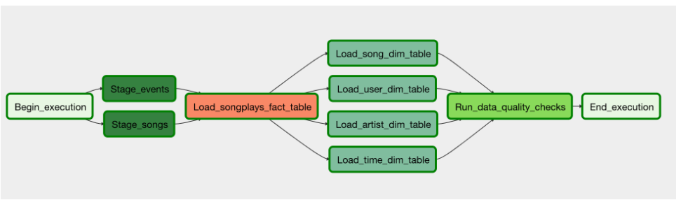

# ETL SPARKIFY  
Sparkify's data and user population has increased and with the growth a need for a data lake has become necessary. Their data is currently in a S3 bucket as json files that is seperated by user activity in log files and a directory with all the songs listed on their app.  

The goal of this project is to build Airflow Operators that extract's Sparkify's data from the S3 bucket and transform the data and loads it AWS Redshift dimension and fact tables.  

## Quick Start  
* Launch and airflow cluster.
* Then, create an IAM role with write/read permission to S3 and fill in AWS access key (KEY) and secret (SECRET) and create the variable aws_credentials in airflow.
* Then, launch a Redshift cluster and get the information to access the database. Create a variable in Airflow called redshift.
* Create an S3 bucket and replace the output_file variable with the S3 bucket location
 

# DAG Flow

## Tables  
    *Staging Tables: staging_events, staging_songs
    *Fact Table: songplays: attributes referencing to the dimension tables.
    *Dimension Tables: users, songs, artists and time tables.

## Build Status  

 The project has been completed and ready for deployment.  

 ## Code Style  

 Standard.  
